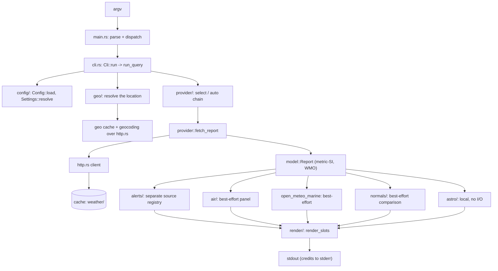

<!--
SPDX-FileCopyrightText: 2026 Yangtse Su <yangtsesu@gmail.com>
SPDX-License-Identifier: GPL-3.0-or-later
-->

# Architecture

`cirrocast` is one synchronous Rust 2024 binary: it reads a command line, resolves a place, asks
one or more HTTP services for a forecast, folds the answer into one canonical document, and renders
that document. This file is the map of the code — where each responsibility lives, how a request
travels from `argv` to `stdout`, what the process writes to disk, and the invariants every change is
held to. The binding version of the same contract (the module map, the provider trait, the rendering
and configuration rules) lives in [`docs/plans/README.md`](plans/README.md); this document describes
the shipped tree and must not contradict it.

Related: [configuration](configuration.md) — every config key and default; [providers](providers.md)
— rate limits, quotas and licence duties per backend; [formats](formats.md) — the `%`-token table
and the layout rules; [schema](schema.md) — the JSON and config schemas; [ecosystem](ecosystem.md)
— the `status` probe and the frozen output contracts; [performance](performance.md) — the resource
budget.

## Module map

```
src/
  main.rs            thin entry: parse argv, read setting provenance, dispatch, Error -> exit code
  lib.rs             library root: module tree, and fetch_reports / worst_exit_code for a run
  cli.rs             clap definitions, location-argument parsing, subcommand dispatch, RenderSetup
  error.rs           Error enum (thiserror), Result alias, the exit-code mapping
  paths.rs           XDG resolution (config/cache/data dirs) via etcetera
  http.rs            the single outbound HTTP path: timeouts, UA, retries, proxy, error taxonomy
  cache.rs           on-disk response cache: keys, TTLs, atomic writes, CacheMode, injectable Clock
  template.rs        the `%`-token engine: TOKENS table, presets, width/precision, escapes
  parallel.rs        ordered parallel map (slot i written by item i) for multi-location runs
  status.rs          the `status` probe: one line, the failure policy, the placeholder
  i18n.rs            Fluent catalogs, locale negotiation; no wire format lives here
  config/
    mod.rs           Config struct, load/merge/save, schema gate and migration hooks, Settings
    keys.rs          BYOK key store (env -> keys.toml @0600), named credentials, masking
  model/
    mod.rs           Location, Current, DayPart, DayForecast, Report, Attribution
    condition.rs     canonical WMO 4677 code newtype + classification helpers
    units.rs         UnitSystem, ResolvedUnits: the crate's only unit-conversion point
    alert.rs         CAP-shaped alert types
    air.rs           AirQuality, Pollen, AirSource
    astro.rs         Astro, Moon, Sun, MoonPhase, Polar, SunSource
    marine.rs        Marine, MarineDay, MarineSource
    normals.rs       Normals: one climate comparison
  geo/
    mod.rs           Geocoder trait, IpLocator trait, LocationSpec, Resolved/Resolution
    chain.rs         the `[geo] search` chain: Open-Meteo -> GeoNames -> Nominatim
    open_meteo.rs    Open-Meteo geocoding (keyless)
    nominatim.rs     OSM Nominatim fallback (`~query`), 1 req/s + mandatory cache
    geonames.rs      GeoNames searchJSON (BYOK named credential)
    ip.rs            ipwho.is -> ipapi.co -> IP.SB fallback chain
    offline.rs       bundled/user city table: folded-key search, no network
    country.rs       the offline country layer (Natural Earth admin-0, CC0)
    table.rs         the binary city-table codec (decode, search, install) shared with the builder
    fold.rs          the NFKD name folding shared by the builder and the runtime
    rank.rs          the one candidate ordering every source feeds
    merge.rs         de-duplicating candidates several sources answered with
    reverse.rs       naming a coordinate: bundled tables first, Nominatim only on a miss
    pick.rs          the interactive picker: ranked list, one line of input, the three-strike rule
    tz.rs            offline coordinate -> IANA zone (`tzf-rs`), for payloads that carry none
    update.rs        `location update-data`: build/verify/install the user table
    data/            cities.bin.gz + keys.bin.gz + SNAPSHOT + countries.bin.gz + COUNTRIES
  auth/
    mod.rs           QWeatherAuth: the credential header a request carries (key or JWT)
    jwt.rs           Ed25519 JWT minting for QWeather (step 27)
  air/
    mod.rs           air-quality facade (best-effort, one panel per run)
    aqi.rs           the US and European AQI category scales
    open_meteo.rs    Open-Meteo Air Quality API (keyless)
  astro/
    mod.rs           Astro::compute, GMST, the local-day window and the shared rise/set search
    julian.rs        Julian dates and the ΔT seam (Espenak–Meeus fits)
    moon.rs          truncated ELP-2000/82 position, phase, illumination, age, rise/set
    sun.rs           solar position and the local day's sunrise/sunset/polar state
  alerts/
    mod.rs           source registry, coverage selection, fetch/dedup/order, credit lines
    cap.rs           hand-written CAP 1.2 state machine (quick-xml), no entity expansion
    geometry.rs      the point-in-polygon gate for CAP polygons and GeoJSON rings
    nws.rs           api.weather.gov alerts (US and territories)
    meteoalarm.rs    the MeteoAlarm EDR service (EUMETNET members)
    qweather.rs      QWeather warnings (China; reuses the forecast credential)
    hko.rs           the Hong Kong Observatory warning summary and details
    wmoswic.rs       the WMO Severe Weather Information Centre aggregator
    fpas.rs          the FOSS Public Alert Server aggregator
  provider/
    mod.rs           Provider trait, ProviderId, registry metadata, select/auto, fetch_chain
    dayparts.rs      the four-part aggregation every hourly backend feeds
    open_meteo.rs    Open-Meteo (keyless, default)
    openweathermap.rs / weatherapi.rs / worldweatheronline.rs
    pirateweather.rs / qweather.rs / smhi.rs
    met_no.rs / nws.rs / brightsky.rs / visualcrossing.rs
    open_meteo_archive.rs / open_meteo_marine.rs
    metar.rs         aviationweather.gov METAR/TAF (keyless, station based)
    metar/decode.rs          the raw METAR/TAF decoder (groups, present weather, clouds)
    metar/station_table.rs   the embedded station table and its lookup
  normals/
    mod.rs           climate-normals facade (best-effort comparison)
    ncei.rs          NOAA NCEI Global Summary of the Month source
  render/
    mod.rs           Renderer trait, Slot/render_slots, RenderContext, TermCaps, width/colour
    art_table.rs     wttr.in-style day-part column table, 2-4 location summary layout
    one_line.rs      template output (`%c`, `%t`, ... wttr.in-compatible tokens)
    plain.rs         box-free, pipe friendly records
    json.rs          stable JSON document
    alerts.rs        the alert banner, records and listing
    air.rs           the air-quality panel, records and standalone view
    moon.rs          the moon/sun panel, records and standalone view
    marine.rs        the marine panel
    normals.rs       the climate-normal comparison block
    art.rs           canonical condition -> unicode art blocks (day/night)
    color.rs         256-colour palette, NO_COLOR / CLICOLOR_FORCE handling
locales/             en-US/main.ftl, zh-CN/main.ftl, ...
tests/               integration tests (CLI level), fixtures/ = recorded API responses
```

`main.rs` and `lib.rs` are the only boundaries: `main.rs` parses, reads each setting's provenance
(`Sources::read`) and turns one `cli.run()` result into an exit code; everything else is a module of
the library. `lib.rs` re-exports the module tree and owns the two run-level mechanics that are
policy rather than plumbing — `fetch_reports` (one report per location, in argument order) and
`worst_exit_code` (the largest mapped code among a run's failures).

## Request data flow

A weather query is `cirrocast [OPTIONS] [LOCATION]...`. The order below is the order `src/cli.rs`
executes: settings and the format are validated before any request, the location is resolved before
the forecast because every backend needs it, and the extra panels are attached to a report that is
already in hand.



Concretely, per invocation:

1. **`main.rs`** keeps the `clap::ArgMatches`, reads which tier supplied each setting
   (`Sources::read`) and only then builds the typed `Cli`. A failure returns the variant's
   `Error::exit_code()` after printing `error: <msg>` to stderr (plus the cause chain under `-v`).
2. **`run_query`** (in `cli.rs`) resolves `Paths`, loads `Config`, merges flags/env/config into
   `Settings`, and builds `RenderSetup` — format, template, units, language, width and palette —
   *before* any traffic, so a typo in `--format`/`--provider` costs nothing. It opens the two cache
   views (geo scope and weather scope, each under its own offline policy), builds the shared
   `HttpClient` over a `UreqTransport`, and derives the provider chain.
3. **Location resolution** (`geo/`) runs per slot, in argument order, before fetching: a coordinate
   is taken as typed, `~query` goes to Nominatim, a name goes through the bundled table then the
   `[geo] search` chain (Open-Meteo → GeoNames → Nominatim), and an empty location is the
   configured default or the IP locator chain. The `PickPolicy` decides whether an ambiguous name
   prompts; the `status` probe never does.
4. **The provider chain** (`provider/`) is walked by `fetch_chain`: the first entry that answers
   wins, and a chain entry falls through only on a transport/upstream error. Each backend's
   `fetch_report` builds its request and decodes its payload; the provided `fetch` is the choke
   point that rejects a report containing a non-finite reading.
5. **`http.rs` and `cache.rs`** sit under every request: the client owns retries/backoff/proxy and
   the error taxonomy, the cache owns keys and TTLs and stores the **raw** upstream body, so a
   provider schema change heals by refetching.
6. **The canonical model** (`model/`) is what comes back: metric/SI values, WMO conditions, four
   day parts per day. Alerts are a **separate source registry**, fetched after the weather answer
   (`alerts/`); air (`air/`), marine (`open_meteo_marine`) and climate normals (`normals/`) are
   best-effort panels attached to the same report; the astro block (`astro/`) is computed locally
   with no I/O at all.
7. **Rendering** (`render/`) turns the report into bytes via `render_slots` (one slot per location),
   and the result is written to stdout through the broken-pipe-safe writer. Credits the data
   licences require go to stderr for `one-line`, reach the document itself for `plain`/`json`, and
   go in the footer for `art-table`.

`serve` (a local wttr-compatible HTTP surface) is **backlog B01 and not implemented**: the binary
has no `serve` subcommand. `cirrocast --help` lists `config`, `key`, `provider`, `location`,
`cache`, `status`, `completion` and `man` — nothing else.

## On-disk state

Every path is resolved from the XDG base directories through `etcetera` (`src/paths.rs`), so
`XDG_CONFIG_HOME`, `XDG_CACHE_HOME` and `XDG_DATA_HOME` are honoured, `XDG_CONFIG_DIRS` is searched
for a system config on reads, and a path in `XDG_CONFIG_DIRS` that is not absolute is ignored.
When the variables are unset the user defaults apply (`~/.config/cirrocast/`,
`~/.cache/cirrocast/`, `~/.local/share/cirrocast/`).

| Path | Mode | Contents |
|---|---|---|
| `$XDG_CONFIG_HOME/cirrocast/config.toml` | `0644` | the typed configuration document, `schema_version = 2`; every key and default is in [configuration](configuration.md) |
| `$XDG_CONFIG_HOME/cirrocast/keys.toml` | `0600` | API keys and named credentials (never in `config.toml`); a file with any group/other bit is refused, not used |
| `$XDG_CACHE_HOME/cirrocast/` | `0700` dirs | the response cache, one JSON envelope per entry, written `tmp` + `rename` |
| `$XDG_DATA_HOME/cirrocast/geo/` | — | the user-installed city table, written only by `location update-data` |

### `keys.toml`

A single `[keys]` table (`openweathermap = "…"`), plus one `[jwt.<provider>]` table for a provider
with a second authentication mode (QWeather): the PEM private key and its non-secret identifiers
(`credential_id`, `developer_id`, `project_id`). Precedence for a provider key is
`CIRROCAST_<PROVIDER>_KEY` env var → `keys.toml`; a JWT provider checks the environment quartet →
`[jwt.<provider>]` → the API-key tiers, and a *partial* JWT set is a configuration error, never a
silent fall-through. The file is `0600` and checked on load; tokens are minted per fetch and never
written to disk.

### Cache layout and namespaces

The root holds one directory per namespace, every entry a `.json` envelope whose body is the raw
upstream text. `CacheKey` builds the names; `<lat>`/`<lon>` use two decimals and `<date>` is the
location-local `YYYY-MM-DD`.

| namespace | key shapes | TTL |
|---|---|---|
| `weather` | `<provider>-<lat>-<lon>-<days>-<local-date>`; `<provider>-<part>-<lat>-<lon>-<days>-<local-date>` (multi-request backends); `<provider>-<icao>-<resource>` (METAR current/TAF); `<source>-air-<lat>-<lon>-<local-date>` | `weather_ttl_secs` |
| `geocode` | lowercase hex SHA-256 of the normalised request | `geocode_ttl_secs` |
| `ip` | `<service>` | `ip_ttl_secs` (capped at 24 h) |
| `station` | `<icao>` | 30 days |
| `alerts` | `<source>-<lat>-<lon>-<YYYYmmddTH>`; a CAP document fetched by identifier hashes the identifier | `alerts.cache_ttl_secs` |
| `grid` | `<provider>-<lat.3dp>-<lon.3dp>` | 30 days |
| `normals` | `<station>-<period>-<MM>`; `search-<lat>-<lon>-<radius>km` | 30 days |

Two small state namespaces hold state, not cached answers: `ratelimit/` (the OSM Nominatim
one-request-per-second stamp) and `geo/` (the `[geo] update = "check"` freshness notice, at most
once per 24 hours). `cache stat` reports the seven entry namespaces in a fixed order, then the two
state namespaces, and ignores a crashed run's `.<name>.tmp.<pid>` staging files. On a fresh cache:

```text
weather      0 entries       0 B
geocode      0 entries       0 B
ip           0 entries       0 B
station      0 entries       0 B
alerts       0 entries       0 B
grid         0 entries       0 B
normals      0 entries       0 B
ratelimit    0 entries       0 B
geo          0 entries       0 B
```

`cache clean` removes expired entries; `cache clean --all` removes the whole tree including staging
files. `--no-cache`, `--refresh` and `--offline[=<weather|geo|all>]` select the `CacheMode`
(`Normal`, `NoCache`, `Refresh`, `Offline`); an offline policy silences only its own scope.

### Geo data tables

Two tables exist, and the bundled one is always the default and the fallback:

* **bundled**, inside the binary (`src/geo/data/`): `cities.bin.gz` (the `GeoNames` cities15000
  rows), `keys.bin.gz` (the sorted folded-name index, decoded on every search; a miss costs only
  this member), `SNAPSHOT` (the provenance record: dump date, source URL, input SHA-256, row and
  key counts), and the country layer `countries.bin.gz` + `COUNTRIES`. They are embedded with
  `include_bytes!`/`include_str!` — there is no runtime file lookup for the default path.
* **user-installed**, `$XDG_DATA_HOME/cirrocast/geo/`: `cities.bin.gz`, `keys.bin.gz` and
  `SNAPSHOT`, written only by `location update-data` (which builds them from a `cities15000` dump
  through `geo::table` and swaps them in with renames). Nothing in the query path ever fetches city
  data; `[geo] data` selects `auto` (user table, else bundled), `bundled` or `user`, and
  `[geo] update = "check"` is a freshness note only.

## Invariants

These are the rules a change must not break; the binding wording is the [architecture
contract](plans/README.md#architecture-contract).

* **Metric-SI storage, one conversion point.** Every numeric field is stored canonically
  (`temp_c`, `wind_kmh`, `precip_mm`, `pressure_hpa`, `visibility_km`); a provider requests metric
  upstream wherever the API allows it. Unit conversion and display formatting live only in
  `src/model/units.rs`, are reached only through `src/render/`, and a renderer holds one
  `ResolvedUnits`. Cache entries are therefore unit-independent, and a second conversion point must
  not appear.
* **Canonical conditions.** A condition is a WMO 4677 code (`model::Condition`). Providers own the
  mapping from their native codes; rendering and text never branch on a provider-specific code.
  The original code survives only in the attribution/raw payload for debugging.
* **Synchronous HTTP, no async runtime.** The stack is `ureq` + `rustls`; `fetch` takes `&self` and
  returns a value. There is no `tokio`/`reqwest` in the graph. Adding one means changing the
  provider contract first.
* **No `unsafe`.** `unsafe_code = "forbid"` in `Cargo.toml`; `unwrap`/`expect`/`panic!` and failing
  indexing are banned outside tests. User-triggered failures are typed `Error` values with stable
  exit codes (0–6, in [ecosystem](ecosystem.md) and `--help`).
* **XDG only.** Configuration, cache and data live under the three XDG bases; there is no
  `~/.cirrocast` and no cwd-relative state.
* **Determinism (injected clock and transport).** Nothing reads the wall clock directly: code that
  needs "now" asks the `cache::Clock`, and the HTTP client takes a `Transport` (`UreqTransport` for
  real traffic, `StubTransport` in tests), so timing and retry behaviour are asserted instead of
  slept through. No test opens a socket. Candidate ranking is a pure total order (`geo::rank`), so
  the same query resolves the same way in offline and network modes.
* **Layering.** `src/render/` reads the model and never a fetch module; `src/air`, `src/alerts`,
  `src/normals` and `src/astro` attach to `Report::air`/`alerts`/`normals`/`astro` and are not read
  by the render layer directly — a renderer shapes its output from the data alone.

## Threading model

The program is single-threaded except for one case: a run with more than one location. Then
`fetch_reports` dispatches through `src/parallel.rs`:

* **Worker count.** `worker_count` is `min(locations, min(4, available_parallelism))`, at least one;
  a single location never spends a thread.
* **Ordered output.** `par_map_ordered` runs `workers` scoped threads over an atomic counter and
  writes each result into slot `i` for item `i` under a `Mutex`, so the vector's order is the
  input's order by construction — never arrival order. Location resolution itself is a **serial
  pre-pass** in argument order before any fetch, so `--pick` reads stdin in the order the user
  typed the locations and an identical command line prints identical stdout.
* **Failure isolation.** A slot that fails keeps its place: its error goes to stderr, a
  one-line placeholder takes its slot on stdout (the renderer decides the shape; `json` uses an
  error document), the other locations render normally, and the process exits with the numerically
  largest `Error::exit_code()` among the failures.
* **`fetch_report` is `&self` and sends no thread-local state**, which is what lets the shared
  `Env` (client, caches, config) be handed to every worker.

The **`status` probe is not that path.** A status bar runs it on a timer, so it must never block on
input: it resolves exactly one location with `Prompt::Never` (an ambiguous name takes the ranked
winner), never performs the public-IP lookup, and runs its cache in whatever offline policy the
flags/config gave it. It fetches alerts only when the template shows `%A` and air only when it
shows `%q`. Its line, colour and exit-code contract — a transient or data failure is exit 0 with the
placeholder on stdout, not a crash — is in [ecosystem](ecosystem.md).
